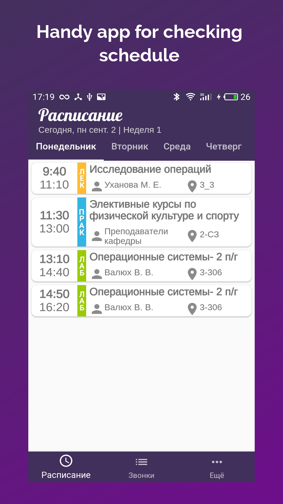
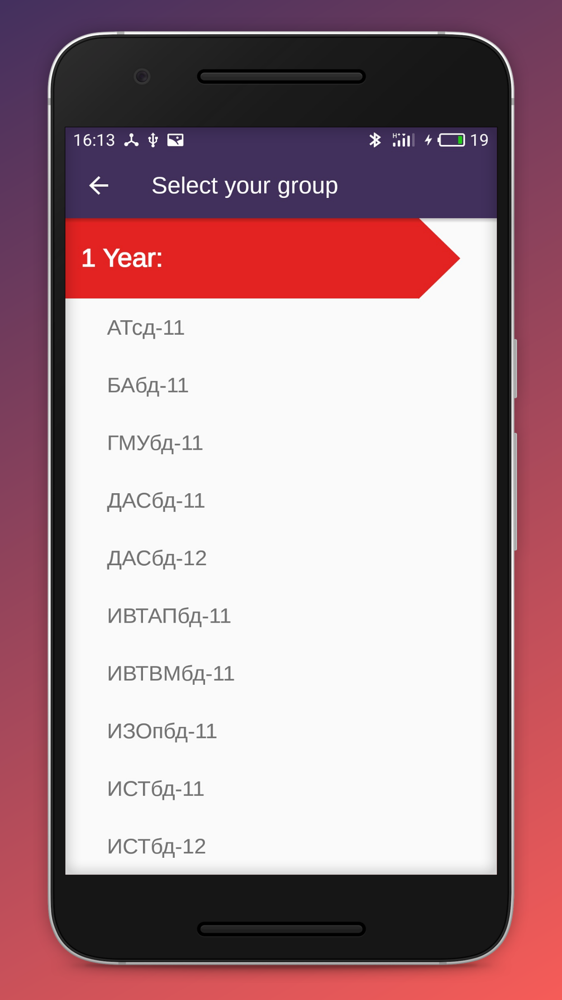
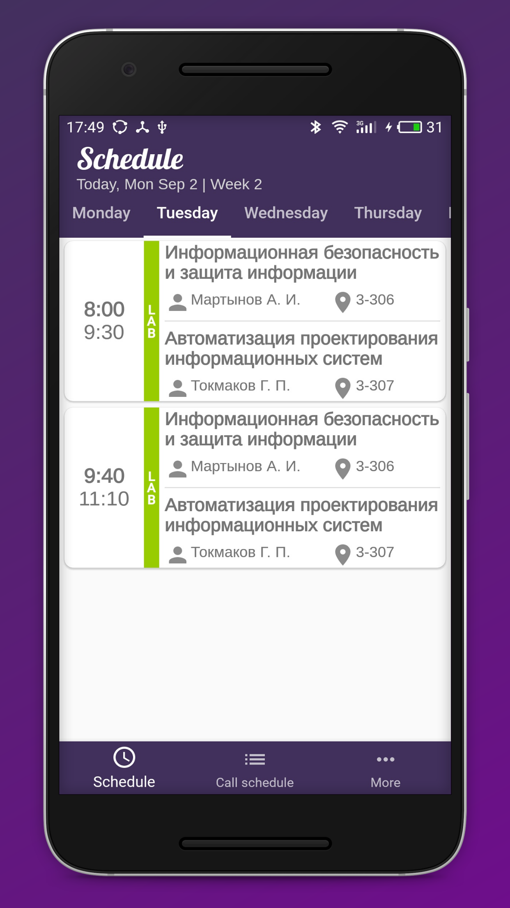
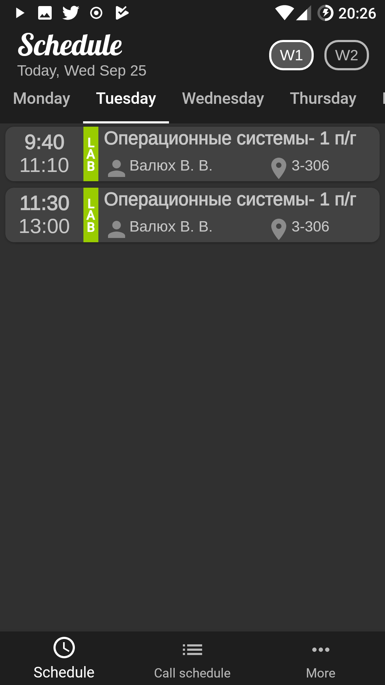
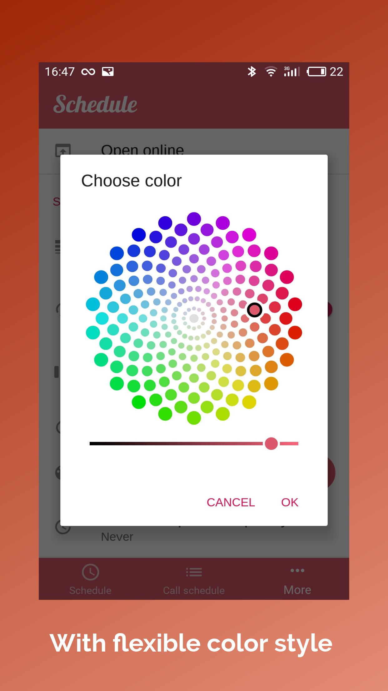

# Schedule

<b>Schedule</b> is a simple open-source application for managing university schedule. 
For now it only supports <a href='http://www.ulstu.ru/main/view/article/100'>ULSTU</a>. 
       

## Screenshots

   
    
  
     
  

## Features
  - Dark mode
  - Wide range of colors to customize application style
  - Push notifications if schedule has been updated
  - Nice design(or not)
  
## Installation
  - Download <a href='APK/ScheduleApp-v1.1.0.apk'>apk file</a>
  - Set in security options of your device intallation from unknown sources if it not enabled already
  - Install application
  
  ---
 
# Расписание

<b>Расписание</b> - это приложение с открытым исходным кодом, которое позволит просматривать расписание университета.
В данный момент поддерживается лишь <a href='http://www.ulstu.ru/main/view/article/100'>УлГТУ</a>. 
       

## Возможности
  - Тёмная тема
  - Большое количество цветов для настройки внешнего вида приложения
  - Push-уведомления при обновлении расписания
  - Приятный дизайн(или нет)
  
## Установка
  - Скачайте <a href='APK/ScheduleApp-v1.1.0.apk'>apk-файл</a>
  - В настройках безопасности Вашего устройства включите установку из незивестных источников, если уже не сделали это
  - Устанвоите приложение
